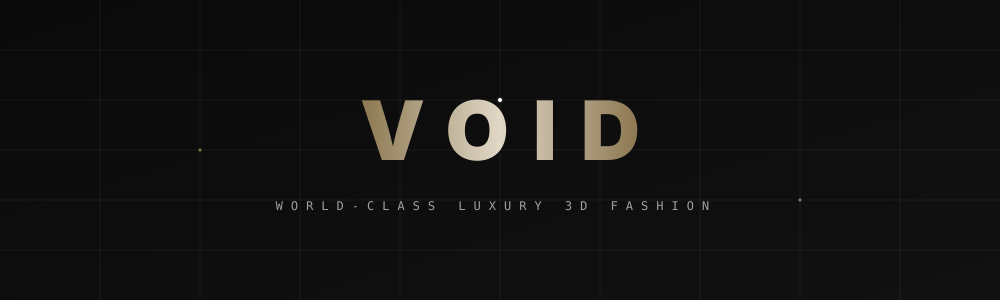
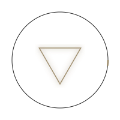

<div align="center">
  
  <a href="#">
    
  </a>

  <br />
  
  <a href="#">
    
  </a>

  <h3 align="center">VOID — World-Class Luxury 3D Fashion E-Commerce</h3>

  <p align="center">
    An avant-garde digital storefront redefining high-fashion retail through immersive 3D experiences, kinetic typography, and fluid GSAP animations.
    <br />
    <br />
    <a href="#features"><strong>Explore Features »</strong></a>
    <br />
    <br />
  </p>

  <p align="center">
    
    
    
    
    
    
  </p>
</div>

---

## ✦ The Vision

**VOID** is not just an e-commerce platform; it's a digital atelier. We bridge the tactile reality of haute couture with the boundless possibilities of digital space. Every garment is presented not as a flat image, but as a sculpted artifact you can explore, rotate, and experience in real-time 3D.

<div align="center">
  
</div>

## ✦ Core Experiences

### 1. Immersive 3D Showroom
Powered by `@react-three/fiber` and `drei`, our product detail pages render photorealistic 3D models of our garments. Zoom into the weave of the fabric, rotate the silhouette, and witness how light interacts with luxury materials.

### 2. Kinetic Editorial Lookbooks
Built with `GSAP ScrollTrigger` and `@studio-freight/lenis` for buttery-smooth smooth scrolling. Our lookbooks are editorial storytelling experiences, blending parallax media, staggered reveals, and Apple-physics drag galleries.

### 3. Hyper-Optimized Delivery
The architecture uses strict caching and a custom `<Image>` pipeline featuring real-time pulsing skeleton loaders. Assets are chunk-hashed and immutably cached at the edge, ensuring lightning-fast loads even on 3G connections.

<div align="center">
  
</div>

## ✦ Getting Started

To run the VOID atelier locally and experience the digital showroom:

```bash
# 1. Clone the repository
git clone https://github.com/your-username/void-fashion.git
cd void-fashion

# 2. Install dependencies
npm install

# 3. Start the development server (Client + Server)
npm run dev
```

Visit `http://localhost:3000` to enter the VOID.

<div align="center">
  
</div>

## ✦ Tech Stack & Architecture

- **Frontend Core**: React 19, TypeScript, Vite
- **Styling & Motion**: Tailwind CSS, Framer Motion, GSAP + ScrollTrigger, Lenis Smooth Scroll
- **3D Engine**: Three.js, React Three Fiber, React Three Postprocessing
- **State & Data**: Zustand (Global State), React Query (Data Fetching), Axios
- **Form & Validation**: React Hook Form, Zod
- **Commerce API**: Stripe Elements

## ✦ License

Proprietary © 2026 VOID Fashion. All rights reserved. 
Visual assets and branding are the property of the VOID Design Atelier.

<div align="center">
  <br />
  
</div>
